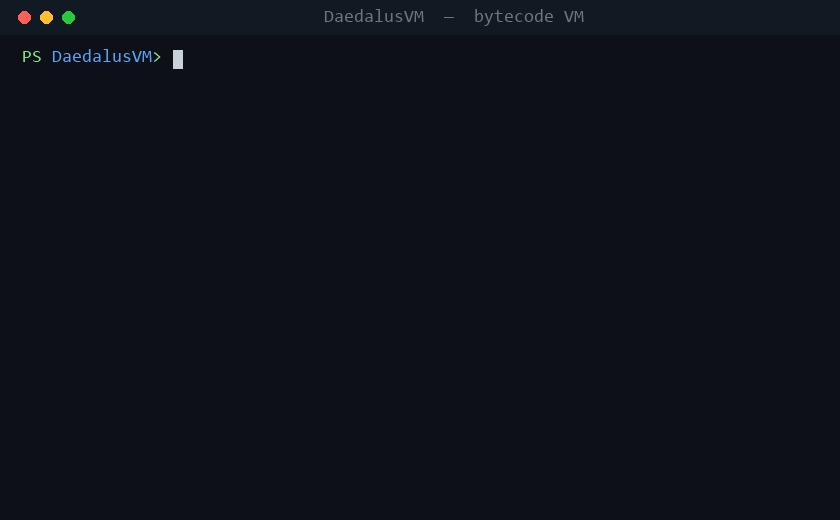

# DaedalusVM

DaedalusVM is a lightweight custom virtual machine loader for experimenting with bytecode execution, instruction dispatch, and virtualized control flow.

<p align="center">
  
</p>

## Overview

The project is split into two small pieces:

- `Ap3xVMLoader.cpp` implements the VM runtime and executes bytecode.
- `compiler/` contains a Go assembler that turns `.vm` source files into raw `.bin` bytecode.

The VM supports registers, arithmetic, comparisons, jumps, string storage onto a stack, and register-width prefixes for 64-bit, 32-bit, 16-bit, and 8-bit values.

## Requirements

- Windows
- CMake 3.20+
- Visual Studio 2022 with the C++ (MSVC) toolset
- Go (for the assembler)

## Build

The project builds with CMake, which compiles the C++ loader and — when Go is
installed — the assembler in one step:

```powershell
cmake -S . -B build
cmake --build build --config Release
```

This produces:

- `build\Release\Ap3xVMLoader.exe` — the VM loader
- `compiler\VMCompiler.exe` — the Go assembler

## Usage

Compile a VM source file:

```powershell
compiler\VMCompiler.exe examples\02_loop_sum.vm
```

Run the generated bytecode:

```powershell
build\Release\Ap3xVMLoader.exe examples\02_loop_sum.bin
```

If no bytecode file is provided, the loader runs its built-in demo program.

To build, assemble, and run an example in one go:

```powershell
cmake --build build --config Release
compiler\VMCompiler.exe examples\03_factorial.vm
build\Release\Ap3xVMLoader.exe examples\03_factorial.bin
```

## Example VM Code

```text
mov @rax, 5
mov @rbx, 10
add @rax, @rbx     // rax = 15
halt
```

See the `examples/` folder for more sample programs; each ends with an
`expected:` comment listing its register/stack result.

## Language

- **Comments**: `//` to end of line. Note the assembler lowercases every line.
- **Registers**: `@` + size + name, e.g. `@rax`, `@lbx`.
  - Names: `ax bx cx dx sp bp si di` (indices 0–7).
  - Sizes: `r` = 64-bit, `e` = 32-bit, `u` = 16-bit, `l` = 8-bit.
    Reading `@lax` yields the low byte of `ax`, `@uax` the low 16 bits, etc.
- **Immediates**: decimal or `0x` hex. An immediate's width follows the
  destination register's size, so `mov @lax, 16` writes one byte.
- **Labels**: define with `.name` on its own line; branch with `jmp .name`.
- **Strings**: `store "text"` pushes the string's bytes onto the stack.

### Instructions

| Working | Purpose |
|---------|---------|
| `mov`   | copy register/immediate into a register |
| `add` `sub` `mul` `div` `mod` | arithmetic (result in the destination register) |
| `cmp`   | set the zero flag when operands are equal |
| `jmp` `go2` | unconditional branch to a label |
| `jz` `jnz`  | branch on the zero flag |
| `push` `pop` | push a register's value / pop the top of the stack into a register |
| `store` | push a string's bytes onto the stack |
| `halt`  | stop the VM |

Accepted operand shapes: `reg,reg` · `reg,imm` · `imm,imm` · `reg` · `string` ·
`label` · none.

## Bytecode format

Bytecode is a flat byte stream. Execution starts at offset 0; each instruction
is one **opcode byte** followed by zero or more operand bytes whose layout is
chosen by the opcode's prefix.

### Opcode byte

The high 3 bits are the operand **prefix**; the low 5 bits are the
**instruction index**. Five bits are needed because there are 17 instructions
(0–16) — a nibble would overflow at `halt` (16).

```
 bit   7   6   5   4   3   2   1   0
      +-----------+-------------------+
      |  prefix   |  instruction idx  |
      |  (0..5)   |     (0..16)       |
      +-----------+-------------------+
        byte = (prefix << 5) | index
```

Instruction indices:

| idx | instr | idx | instr | idx | instr |
|----:|-------|----:|-------|----:|-------|
| 0 | `add` | 6 | `jz`  | 12 | `load`  |
| 1 | `sub` | 7 | `jnz` | 13 | `store` |
| 2 | `mul` | 8 | `cmp` | 14 | `go2`   |
| 3 | `div` | 9 | `ret` | 15 | `mov`   |
| 4 | `mod` | 10 | `push` | 16 | `halt` |
| 5 | `jmp` | 11 | `pop`  |    |        |

The prefix selects which operand bytes follow the opcode byte:

| prefix | operands  | bytes after the opcode                 |
|:------:|-----------|----------------------------------------|
| 0      | reg, reg  | reg byte, reg byte                     |
| 1      | reg, imm  | reg byte, immediate (width = reg size) |
| 2      | imm, imm  | 8-byte immediate, 8-byte immediate     |
| 3      | string    | length byte, then `length` char bytes  |
| 4      | label     | 2-byte little-endian address           |
| 5      | none      | (nothing)                              |
| 6      | reg       | reg byte                               |

### Register byte

The high nibble is the register **size**; the low nibble is its **index**.

```
 bit   7   6   5   4   3   2   1   0
      +---------------+---------------+
      |     size      |     index     |
      +---------------+---------------+
        byte = (size << 4) | index
```

| size nibble | prefix | width           |
|:-----------:|:------:|-----------------|
| 0           | `r`    | 8 bytes (64-bit)|
| 1           | `e`    | 4 bytes (32-bit)|
| 2           | `u`    | 2 bytes (16-bit)|
| 3           | `l`    | 1 byte (8-bit)  |

| index | reg | index | reg |
|:-----:|:---:|:-----:|:---:|
| 0 | `ax` | 4 | `sp` |
| 1 | `bx` | 5 | `bp` |
| 2 | `cx` | 6 | `si` |
| 3 | `dx` | 7 | `di` |

So `@rax` = `0x00`, `@rbx` = `0x01`, `@lax` = `0x30`, `@edi` = `0x17`.

### Immediates, strings, addresses

- **Immediate** (prefix 1): little-endian, with a width taken from the
  destination register's size — `r`=8, `e`=4, `u`=2, `l`=1 bytes. Under
  prefix 2 both immediates are a fixed 8 bytes.
- **String** (prefix 3): one length byte (0–255) followed by that many
  single-byte characters (the assembler lowercases them).
- **Address** (prefix 4): the target label's absolute byte offset, as two
  little-endian bytes (low byte, then high byte).

### Worked examples

```
mov @rax, 5      2F 00 05 00 00 00 00 00 00 00
                 |  |  +----------------------- imm 5, 8 bytes LE (rax is 8-byte)
                 |  +--- reg @rax = (0<<4)|0 = 0x00
                 +------ opcode   = (1<<5)|15 = 0x2F   (prefix 1 reg,imm; mov=15)

add @rax, @rbx   00 00 01
                 |  |  +- reg @rbx = 0x01
                 |  +---- reg @rax = 0x00
                 +------- opcode   = (0<<5)|0 = 0x00   (prefix 0 reg,reg; add=0)

jnz .loop        87 1E 00                       (.loop is at offset 0x001E = 30)
                 |  +--+-- address, little-endian
                 +------- opcode = (4<<5)|7 = 0x87     (prefix 4 label; jnz=7)

store "sum"      6D 03 73 75 6D
                 |  |  +--+--+-- 's' 'u' 'm'
                 |  +---------- length = 3
                 +------------- opcode = (3<<5)|13 = 0x6D (prefix 3 string; store=13)
```

## Project Status

This is a simple experimental VM project. Notes on the current state:

- `ret` and `load` are placeholder handlers (no-ops).
- Register index 7 (`di`) doubles as the stack pointer for `push`/`pop`/`store`,
  so avoid `@rdi` as a scratch register in programs that touch the stack.
- `div`/`mod` by zero halts the VM rather than trapping.
